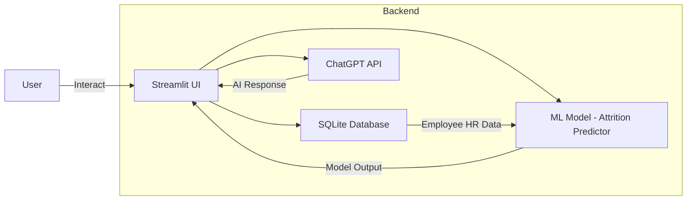
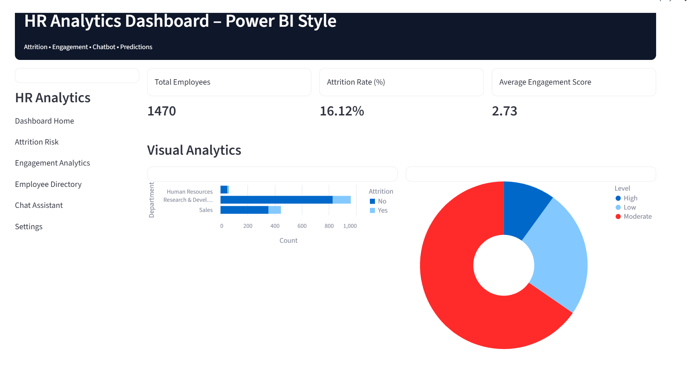
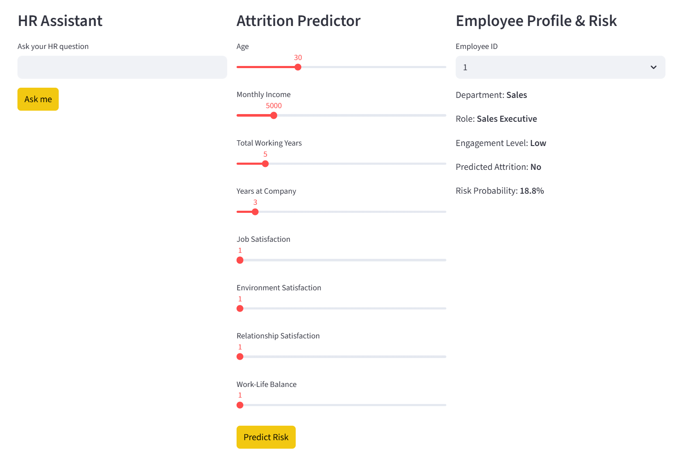
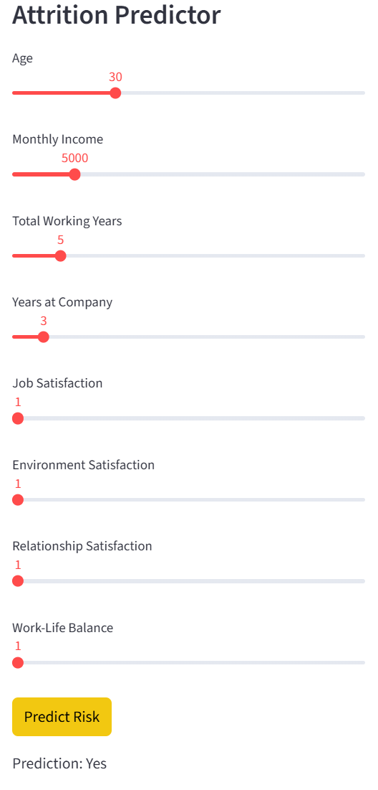
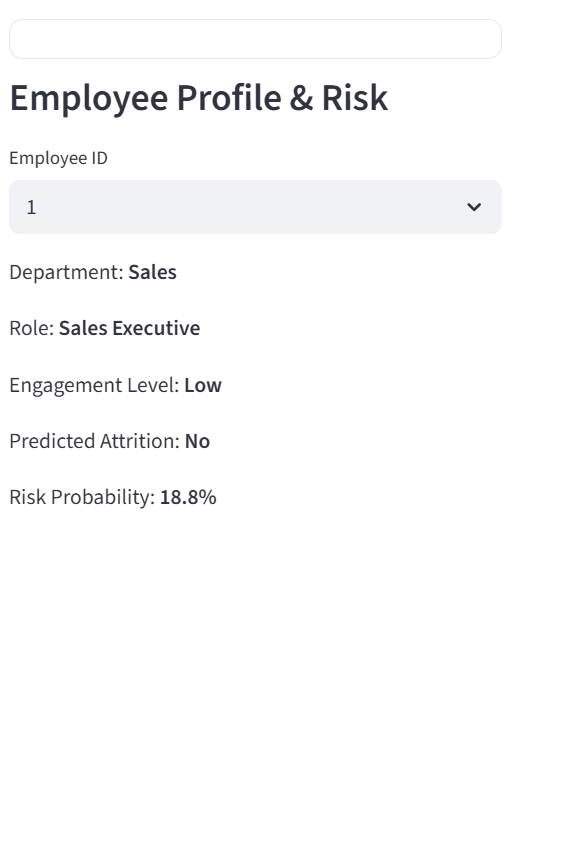

# 🧠 HR Analytics Dashboard – Attrition, Engagement & AI Chatbot

[](https://hr-analytics-attrition-chatbot-34foqrceukpgeg8z3ms8vm.streamlit.app/)


---

## 🚀 Live Demo

Experience the application online:

👉 **https://hr-analytics-attrition-chatbot-34foqrceukpgeg8z3ms8vm.streamlit.app/**

---

## 📌 Project Overview

This is an **end-to-end HR Analytics dashboard application** combining:

- 📊 Power BI–style visual analytics  
- 🤖 ChatGPT–powered HR assistant  
- 📈 Machine Learning attrition prediction  
- 🗄️ SQLite database integration  
- 👩‍💼 Employee engagement & risk profile panels  
- 🚀 Streamlit web app deployment

It provides HR teams with automated insights to:

- Identify disengaged employees
- Predict likelihood of attrition
- Get AI suggestions for HR strategy
- Explore trends with interactive visuals

---

## 🧭 System Architecture



---

## 🛠️ Tech Stack

| Component | Technology |
|-----------|------------|
| Frontend | Streamlit |
| Backend | SQLite |
| ML Modeling | Python / Scikit-Learn |
| AI Assistant | OpenAI ChatGPT API |
| Visualizations | Altair |
| Data Handling | Pandas / NumPy |
| Deployment | Streamlit Community Cloud |

---

## 📸 Screenshots

> Place screenshots in `/screenshots` in your repo with these exact names:

```
/screenshots/dashboard_overview.png
/screenshots/chatgpt_hr_chatbot.png
/screenshots/attrition_prediction_tool.png
/screenshots/employee_profile_risk.png
```

### **Dashboard Overview**


---

### **ChatGPT HR Chatbot**


---

### **Attrition Prediction Tool**


---

### **Employee Profile & Risk**


---

## 🧠 Features

- **Interactive Dashboards:** Filterable, Power BI–style charts
- **ChatGPT Assistant:** Natural language HR insights
- **ML-Based Prediction:** Attrition risk scoring
- **Employee Profile:** Drill down into engagement and risk
- **Responsive UI:** Browser-friendly layout
- **Live Deployment:** Hosted online with Streamlit Cloud

---

## 💾 Dataset Info

Used dataset: **IBM HR Analytics Attrition dataset (Kaggle style)**  
Included features:

- Demographics
- Engagement metrics
- Satisfaction metrics
- Work history
- Attrition labels

Engagement score was constructed from:

- JobSatisfaction
- EnvironmentSatisfaction
- RelationshipSatisfaction
- WorkLifeBalance

---

## 🌀 Installation

Clone the repository:

```bash
git clone https://github.com/your-username/hr-analytics-attrition-chatbot.git
cd hr-analytics-attrition-chatbot
```

Create virtual environment:

```bash
python -m venv venv
# Mac/Linux
source venv/bin/activate
# Windows
venv\Scripts\activate
```

Install dependencies:

```bash
pip install -r requirements.txt
```

Set environment variable:

Mac/Linux:

```bash
export OPENAI_API_KEY="sk-XXXXXXXXXXXX"
```

Windows (CMD):

```bash
setx OPENAI_API_KEY "sk-XXXXXXXXXXXX"
```

---

## ▶️ Run Locally

```bash
streamlit run chatbot_app.py
```

This will launch the dashboard in your browser.

---

## 📈 Model & Chatbot Details

**Attrition Model:**

- Logistic Regression
- Predicts attrition risk
- Features include engagement and demographics

**ChatGPT Assistant:**

- Uses OpenAI API
- Contextual HR analytics and insights
- Can answer queries in natural language or SQL context

---

## 🧾 License

MIT License

---

## 👤 About the Author

**Tonumay Bhattacharya**

- HR Analytics & Data Science  
- Portfolio: *(optional link)*  
- LinkedIn: *(optional link)*  
- GitHub: *(optional link)*

---

## 🛠️ Optional Enhancements (Future)

- Export dashboard to PDF  
- SHAP explainability visuals  
- Timelines and cohort analysis  
- User authentication / RBAC  
- Multi-tenant HR dashboards

---

## ✨ Quick Links

| Resource | Link |
|----------|------|
| Live App | https://hr-analytics-attrition-chatbot-34foqrceukpgeg8z3ms8vm.streamlit.app/ |
| GitHub Repo | https://github.com/your-username/hr-analytics-attrition-chatbot |

